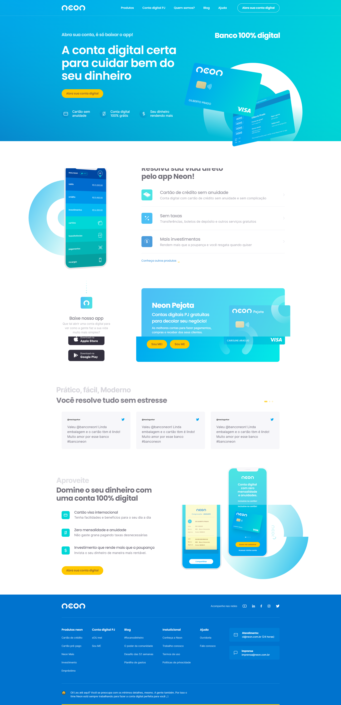

<h1 align="center"> Redesign Lading Page Banco Neon </h1>

  <a href="#-tecnologias">Tecnologias</a>&nbsp;&nbsp;&nbsp;|&nbsp;&nbsp;&nbsp;
  <a href="#-projeto">Projeto</a>&nbsp;&nbsp;&nbsp;|&nbsp;&nbsp;&nbsp;
  <a href="#-layout">Layout</a>&nbsp;&nbsp;&nbsp;|&nbsp;&nbsp;&nbsp;
  <a href="#memo-licença">Licença</a>

  

 

## 🚀 Tecnologias

Esse projeto foi desenvolvido com as seguintes tecnologias:

- HTML
- SCSS
- JavaScript

## 💻 Projeto

Um redesign do Banco NEON, feito no curso Codeboost, apenas para aprendizado, acesse ele clicando [aqui](https://lp-redesing-neon-dev.netlify.app/)

## :memo: Licença

Esse projeto está sob a licença MIT.

---'
